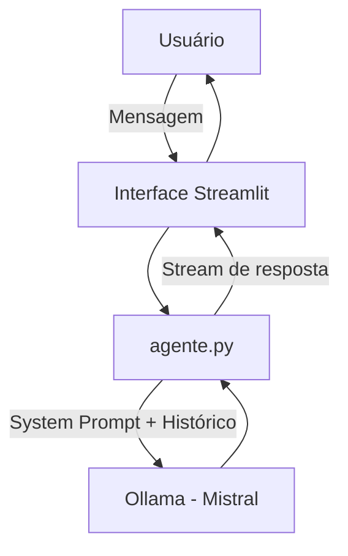

# 🎬 Cleo — Assistente de Recomendação de Filmes, Séries e Livros

A Cleo é uma assistente conversacional que recomenda filmes, séries e livros com base no contexto atual do usuário — não apenas no histórico. Ela conversa, pergunta como você tá, e sugere o que realmente faz sentido para aquele momento.

Roda 100% localmente usando **Mistral via Ollama**. Sem conta, sem API key, sem coleta de dados.

---

## Pré-requisitos

- [Ollama](https://ollama.ai/) instalado
- Python 3.9+
- Modelo Mistral baixado

```bash
# Instalar o modelo (uma vez só)
ollama pull mistral

# Iniciar o servidor Ollama
ollama serve
```

---

## Instalação e Uso

```bash
# Clonar o repositório
git clone <url-do-repo>
cd lab-agente-cleo

# Instalar dependências
pip install -r src/requirements.txt

# Rodar a aplicação
streamlit run src/app.py
```

Acesse `http://localhost:8501` no navegador.

---

## Estrutura do Repositório

```
📁 lab-agente-cleo/
│
├── 📄 README.md
│
├── 📁 src/
│   ├── app.py              # Interface Streamlit
│   ├── agente.py           # Lógica de comunicação com Ollama
│   └── requirements.txt    # Dependências
│
└── 📁 docs/
    ├── 01-documentacao-agente.md   # Caso de uso e arquitetura
    ├── 02-base-conhecimento.md     # Estratégia de dados e contexto
    ├── 03-prompts.md               # System prompt e exemplos
    ├── 04-metricas.md              # Avaliação e casos de teste
    └── 05-pitch.md                 # Roteiro do pitch
```

---

## Como Funciona



O histórico completo da conversa é enviado a cada requisição, permitindo que o modelo mantenha contexto — lembra o que já foi sugerido, o que o usuário disse que já assistiu, e ajusta as próximas recomendações.

---

## Funcionalidades

- Recomendação de filmes, séries e livros
- Sugestões contextualizadas por humor e situação
- Respostas em stream (exibe enquanto gera)
- Sugestões rápidas na tela inicial
- Memória de conversa durante a sessão
- Interface limpa com tema escuro

---

## Documentação

| Arquivo | Conteúdo |
|---------|---------|
| [`docs/01-documentacao-agente.md`](./docs/01-documentacao-agente.md) | Caso de uso, persona e arquitetura |
| [`docs/02-base-conhecimento.md`](./docs/02-base-conhecimento.md) | Como o contexto é estruturado |
| [`docs/03-prompts.md`](./docs/03-prompts.md) | System prompt completo e exemplos |
| [`docs/04-metricas.md`](./docs/04-metricas.md) | Casos de teste e métricas |
| [`docs/05-pitch.md`](./docs/05-pitch.md) | Roteiro do pitch |
