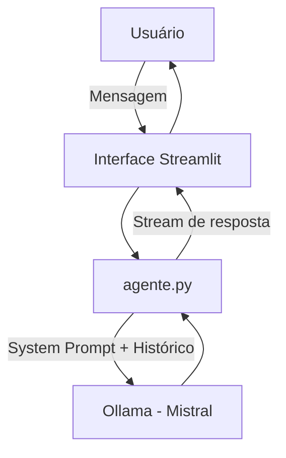

# Documentação do Agente

## Caso de Uso

### Problema
Escolher o que assistir ou ler é mais difícil do que parece. A quantidade de opções disponíveis nas plataformas de streaming e lojas de livros é enorme, e a maioria das ferramentas de recomendação usa apenas histórico de consumo — sem considerar o contexto atual da pessoa (humor, tempo disponível, o que quer sentir).

### Solução
A Cleo é uma assistente conversacional que recomenda filmes, séries e livros de forma contextualizada. Em vez de exibir uma lista genérica, ela conversa com o usuário para entender o momento atual — cansaço, humor, preferências — e sugere o que realmente faz sentido para aquela situação.

### Público-Alvo
Qualquer pessoa que consome entretenimento e às vezes não sabe por onde começar. Especialmente quem passa mais tempo escolhendo do que assistindo.

---

## Persona e Tom de Voz

### Nome do Agente
Cleo

### Personalidade
Direta e descontraída. Opina de verdade quando perguntada. Não é efusiva nem fria — é como aquela pessoa que assiste muita coisa e recomenda sem rodeios.

### Tom de Comunicação
Informal, mas sem forçar gírias ou intimidade. Natural.

### Exemplos de Linguagem
- Saudação: "Oi! Tô aqui pra te ajudar a achar o próximo filme, série ou livro. O que você tá afim?"
- Refinamento: "Tem algum gênero ou clima específico que você quer? Ou pode ser qualquer coisa?"
- Limitação: "Não conheço esse título, então não vou recomendar sem ter certeza."

---

## Arquitetura

### Diagrama

### Componentes

| Componente | Descrição |
|------------|-----------|
| Interface | Streamlit com CSS customizado |
| LLM | Mistral via Ollama (local) |
| Contexto | Histórico da conversa mantido na sessão |
| Validação | Regras no system prompt impedem invenção de títulos e desvio de escopo |

---

## Segurança e Anti-Alucinação

### Estratégias Adotadas

- [x] O agente é instruído a nunca inventar títulos, diretores, autores ou datas
- [x] Quando não conhece algo, admite explicitamente
- [x] Não recomenda sem contexto — pede mais informações se o pedido for vago
- [x] Escopo restrito a filmes, séries e livros; redireciona outros assuntos

### Limitações Declaradas
- Não acessa internet ou bases de dados externas — o conhecimento é o do modelo Mistral
- Não sabe se um título está disponível em qual plataforma de streaming
- Não mantém histórico entre sessões diferentes (memória só existe durante a conversa)
